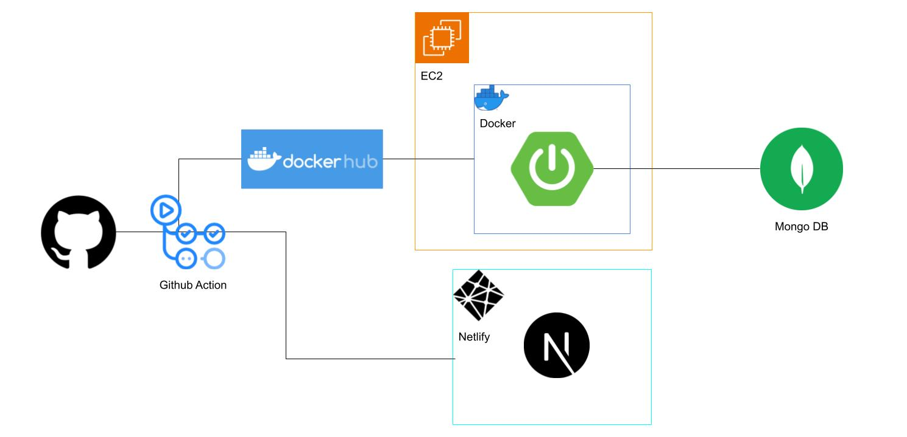

# ERDiagram Simplified

## Site Link
https://poetic-sfogliatella-559e33.netlify.app/
<br><br>

## Demo Video
<video width="100%" controls>
  <source src=".github/videos/version2.mov" type="video/mp4">
</video>
<br><br>

## Architecture (Flow)

<br><br>


## Overview
```
This website allows you to make your own ER Diagram, which represent Database Structure.
This's real time async editor of diagrams, so you can edit it with your friends at the same time
without reloading your browser!
```

### Amazing Features!!
- Real Time Communication (Websocket)
- Interactive UI (Canvas × Next.js)
- Flexible Design with font, color, scale, etc... (NO SQL)
- Authorization (Spring Boot Security)


## Techs
 - Frontend
 ```
 Next.js, React, Typescript, Javascript
 ```

 - Backend
 ```
 Java, Spring-Boot
 ```

- Database
```
Mongo DB
```

 - Others
 ```
 Docker, AWS, Netlify, Github Action
 ```

