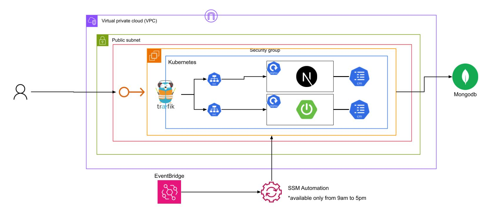

# ERDiagram Simplified

## Site Link
https://erdiagram-simplified.daisukekikuchi.net/
<br><br>

## Demo Video
[](https://youtu.be/Tu6lZYIZPkA)

<br><br>

## Architecture (Flow)

<br><br>


## Overview
This website allows you to make your own ER Diagram, which represent Database Structure.<br>
This is ***real time async editor of diagrams***, so you can edit it with your friends at the same time
without reloading your browser!

### Amazing Features!!
- Real Time Communication (Websocket)
- Interactive UI (Canvas × Next.js)
- Flexible Design with font, color, scale, etc... (NO SQL)
- Authorization (Spring Boot Security)


## Techs
 - Frontend
 ```
 Next.js, React, Typescript, Javascript
 ```

 - Backend
 ```
 Java, Spring-Boot
 ```

- Database
```
Mongo DB
```

 - Others
 ```
AWS, Kubernetes, Github Action, CodeDeploy
 ```

